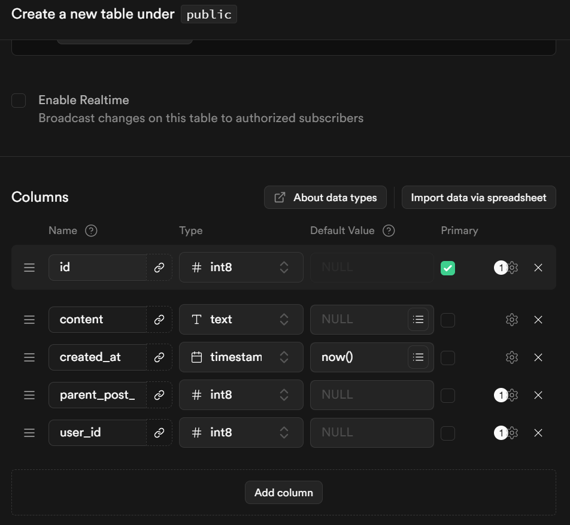
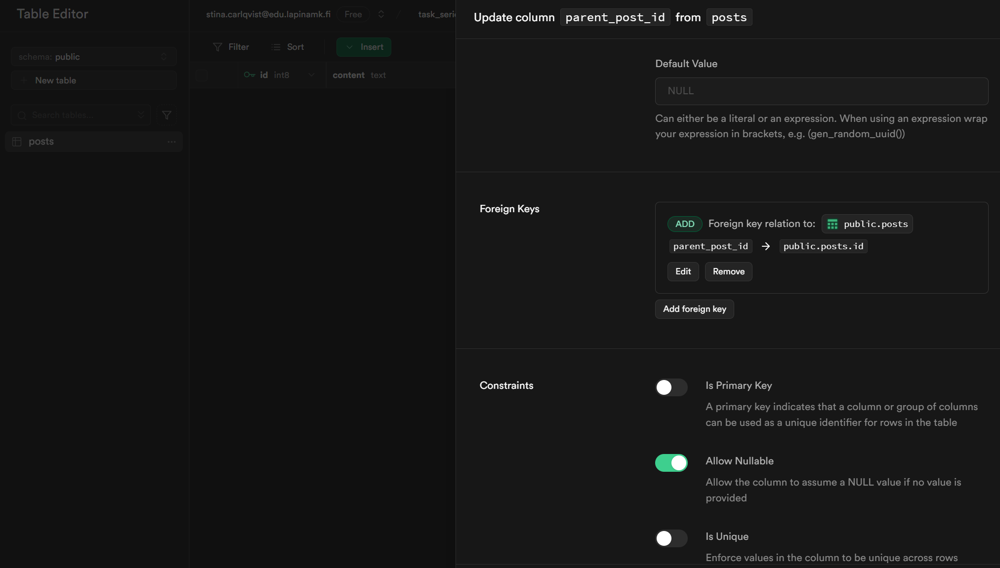
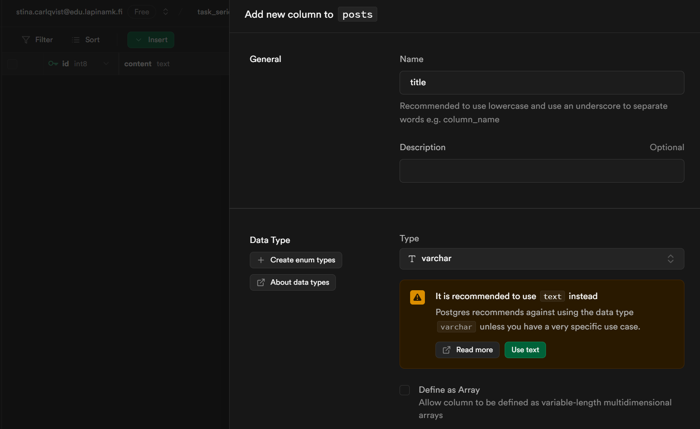
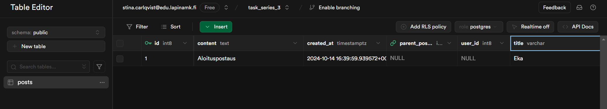
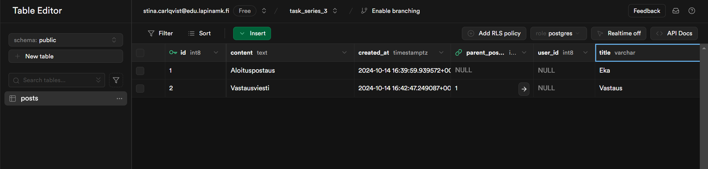
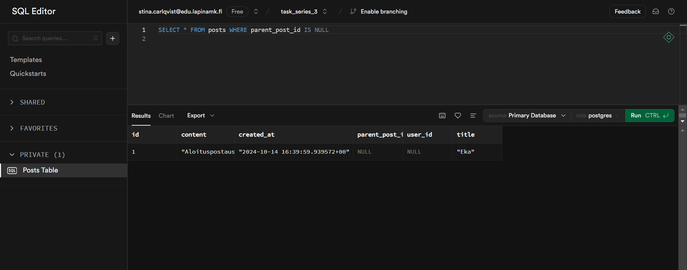
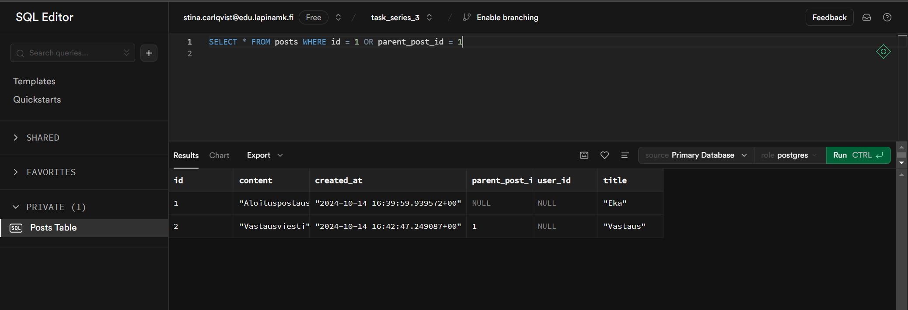

# Tehtäväsarja 3
## Backend ja tietokannat

### Keskustelupalsta

* **1 A** Lisää tietokantaan `posts` taulu:

* **1 B** Lisää `posts` tauluun viiteavain postaukseen itseensä: `parent_post_id -> id`:

* **1 C** Lisää tauluun vielä uusi kenttä (column), josta voisi olla hyötyä tällaisessa keskustelupalstan viestin datassa, esim. title tai topic. 
    - Lisätty title kenttä. Varchar koska voidaan olettaa otsikko tiettyyn pituuteen sekä määritetty pakolliseksi kentäksi.

* **2 A** Lisää tietokantaan viesti.

* **2 B** Lisää tietokantaan myös toinen viesti, tällä kertaa vastausviesti missä `parent_post_id`:ssä on aiemmin lisäämäsi aloitusviestin `id`:

* **2 C** Millä tavalla saat haettua tietokannasta kaikki viestit jotka ovat aloitusviestejä?

* **2 D** Miten saat haettua yksittäisen aloitusviestin id:n perusteella myös kaikki vastaukset kyseiseen aloitusviestiin yhdellä tietokantakyselyllä?

* **2 E** Millä tavoin ratkaisisit viestien poistamiseen liittyvät mahdolliset ongelmat, kun aloitusviestiin on olemassa vastauksia? 
    - En poistaisi viestiä vaan päivittäisin postauksen otsikon ja sisällön seuraavanlaisesti: `UPDATE posts SET content = 'Not found', title = 'DELETED' WHERE id = 1` . Näin relaatiot ja tietokannan eheys säilyy, sekä käyttäjät saavat edelleen lukea vastauksia.

### 3. Suunnittele ja määrittele lisäominaisuus: Tykkäykset viesteihin

* **3 A**  Kuvaile suunnitelemasi lisäominaisuus.
    - Käyttäjä voi reagoida postiviisesti tai negatiivisesti kaikkiin viesteihin.

* **3 B** Luo vaatimusmäärittely. Voit käyttää mallipohjana tehtäväsarjan kuvauksessa määriteltyä keskustelupalstastan määritelmää.
    - Kaikki käyttäjät voivat reagoida kaikkiin viesteihin
    - Reaktion voi poistaa
    - Käyttäjä voi nähdä reaktioiden määrät

* **3 C** Kuvaile tarvittavat muutokset keskustelupalstan data-rakenteeseen.   
    - Tietokantaan pitäisi lisätä `user` taulu käyttäjätietoja varten.
    - `reaction` taulu jossa esim reaktiot 'like' ja 'dislike'.
    - `show_reaction` taulu jolla on foreign key sekä `user`, `reaction` että `posts` tauluun jotta voidaan linkittää käyttäjä, postaus ja reaktio toisiinsa kunkin id:n avulla.

