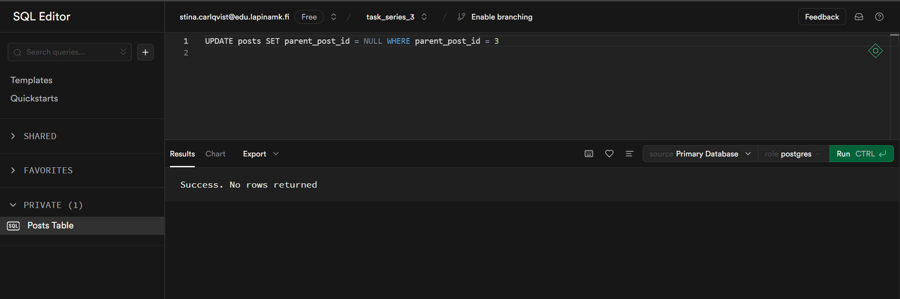
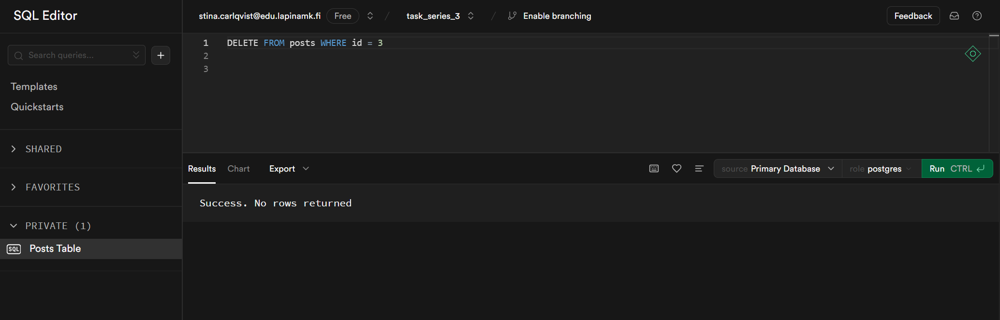

# Tehtäväsarja 3
## Backend ja tietokannat

### Keskustelupalsta

* **1 A** Lisää tietokantaan `posts` taulu:

* **1 B** Lisää `posts` tauluun viiteavain postaukseen itseensä: `parent_post_id -> id`:

* **1 C** Lisää tauluun vielä uusi kenttä (column), josta voisi olla hyötyä tällaisessa keskustelupalstan viestin datassa, esim. title tai topic. Lisätty title kenttä. Varchar koska voidaan olettaa otsikko tiettyyn pituuteen sekä määritetty pakolliseksi kentäksi.

* **2 A** Lisää tietokantaan viesti.

* **2 B** Lisää tietokantaan myös toinen viesti, tällä kertaa vastausviesti missä `parent_post_id`:ssä on aiemmin lisäämäsi aloitusviestin `id`:

* **2 C** Millä tavalla saat haettua tietokannasta kaikki viestit jotka ovat aloitusviestejä?

* **2 D** Miten saat haettua yksittäisen aloitusviestin id:n perusteella myös kaikki vastaukset kyseiseen aloitusviestiin yhdellä tietokantakyselyllä?

* **2 E**  Millä tavoin ratkaisisit viestien poistamiseen liittyvät mahdolliset ongelmat, kun aloitusviestiin on olemassa vastauksia? 

Poistaisin alkuperäisen postauksen sen id:n perusteella, ja määrittäisin vastausten `parent_post_id`:n NULL arvoksi. Näin vastauksia ei poistettaisi, vaikka alkuperäinen viesti olisi poistettu ja NULL arvoksi määrittäminen auttaa pitämään tietokannan eheänä. Voisin myös poistaa vastaukset käyttämällä `DELETE FROM posts WHERE id = 2 OR parent_post_id = 2` kyselyä.

